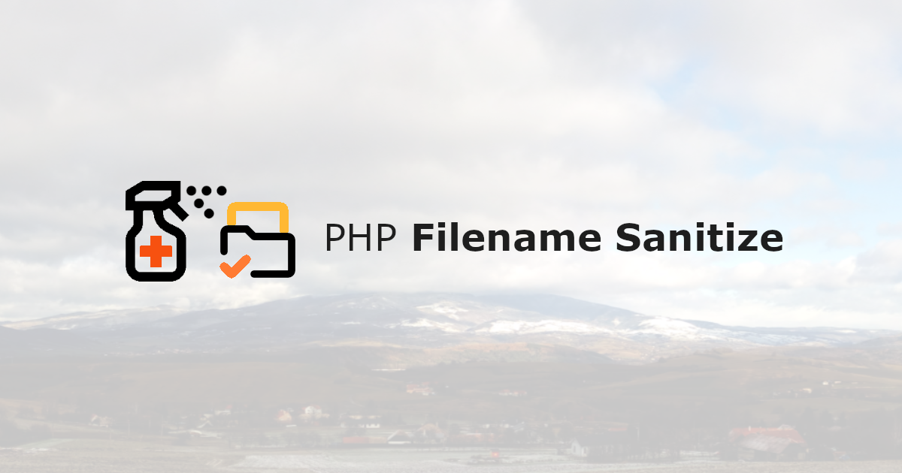

# Removes all forbidden characters from the file name

[](https://packagist.org/packages/ondrej-vrto/php-filename-sanitize)
[](https://github.com/OndrejVrto/php-filename-sanitize/blob/main/.github/workflows/run-tests.yml)
[](https://packagist.org/packages/ondrej-vrto/php-filename-sanitize)


Do you store files from the user on the server? Will the uploaded file be accessible in the application via a URL address? Don't want to lose the original file name?

Want to avoid meaningless randomly generated names? This package will help you solve your problem.

## Installation

You can install the package via composer:

```bash
composer require ondrej-vrto/php-filename-sanitize
```

## Basic usage

```php
use OndrejVrto\FilenameSanitize\FilenameSanitize;

$filename = '[file#name].jpg';

$sanitize_filename = FilenameSanitize::of($filename)->get();
// Output: file-name.jpg
```

## What problems does the package try to eliminate?

1. Replace special characters
    - [file system reserved](https://en.wikipedia.org/wiki/Filename#Reserved_characters_and_words)
    - [control characters](http://msdn.microsoft.com/en-us/library/windows/desktop/aa365247%28v=vs.85%29.aspx)
    - non-printing characters DEL, NO-BREAK SPACE, SOFT HYPHEN
    - [URI reserved](https://www.rfc-editor.org/rfc/rfc3986#section-2.2)
    - [URL unsafe characters](https://www.ietf.org/rfc/rfc1738.txt)
1. Reduce some consecutive characters (spaces, undescores, dashes, dots)
1. [Windows reserved names](https://learn.microsoft.com/en-us/windows/win32/fileio/naming-a-file)
1. [Lowercase for windows/unix interoperability](https://en.wikipedia.org/wiki/Filename)
1. [Max filename length to 255 bytes](http://serverfault.com/a/9548/44086)

### Examples

Strings are sanitized and soft slugged (in addition to dashes, dots are also used).

```txt
file-name.ext                            ->  file-name.ext
火|车..票                                 ->  火-车.票
.github                                  ->  .github
filename                                 ->  filename
.env.test                                ->  .env.test
File NaME.Zip                            ->  file-name.zip
file___name.zip                          ->  file-name.zip
file---name.zip                          ->  file-name.zip
file...name..zip                         ->  file.name.zip
file<->name":.zip:                       ->  file-name.zip
~file-{name}^.[zip]                      ->  file-name.zip
   file  name  .   zip                   ->  file-name.zip
[file~name].{jpg}                        ->  file-name.jpg
file--.--.-.--name.zip                   ->  file.name.zip
file-name|#[]&@()+,;=.zip                ->  file-name.zip
<script>alert(1);</script>               ->  script
<?php malicious_function(); ?>`rm -rf `  ->  php-malicious-function-rm-rf
```

## Advanced settings

### Create instance

```php
// classic object
(new FilenameSanitize($filename))->get();
// or static instance
FilenameSanitize::of($filename)->get();
```

### Directory features

```php
FilenameSanitize::of('/some#/di[]r/file#name.jpg')
    ->withSubdirectory()
    ->get();
// Output: \some\dir\file-name.jpg

FilenameSanitize::of('/some#/di[]r/file#name.jpg')
    ->addSubdirectoryToFilename()
    ->get();
// Output: some-dir-file-name.jpg

FilenameSanitize::of('/some#/di[]r/file#name.jpg')
    ->withBaseDirectory("/base/directory")
    ->get();
// Output: \base\directory\file-name.jpg

// together
FilenameSanitize::of('/some#/di[]r/file#name.jpg')
    ->withBaseDirectory("/base/directory")
    ->addSubdirectoryToFilename()
    ->withSubdirectory()
    ->get();
// Output: \base\directory\some\dir\some-dir-file-name.jpg
```

### Extension features

```php
FilenameSanitize::of('file_name.jpg')
    ->withNewExtension('webp')
    ->get();
// Output: file-name.webp

FilenameSanitize::of('file_name.jpg')
    ->addActualExtensionToFilename()
    ->get();
// Output: file-name-jpg.jpg

// together
FilenameSanitize::of('file_name.jpg')
    ->addActualExtensionToFilename()
    ->withNewExtension('webp')
    ->get();
// Output: file-name-jpg.webp
```

### Prefix, suffix features

```php
FilenameSanitize::of('file_name.jpg')
    ->widthFilenameSuffix('suffix')
    ->widthFilenamePrefix('prefix')
    ->get();
// Output: prefix-file-name-suffix.jpg
```

### Default name if sanitized filename is empty

```php
FilenameSanitize::of(null)
    ->get();
// throw ValueError exception

FilenameSanitize::of(null)
    ->defaultFilename('default-file-name.jpg')
    ->get();
// Output: default-file-name.jpg
```

### A combination of all functions together

```php
FilenameSanitize::of('foo2\bar2\file-name.jpg')
    ->addActualExtensionToFilename()
    ->withBaseDirectory('C:/foo/bar')
    ->widthFilenameSuffix('surfix')
    ->widthFilenamePrefix('prefix')
    ->addSubdirectoryToFilename()
    ->withNewExtension('webp')
    ->withSubdirectory()
    ->get();
// Output:  C:\foo\bar\foo2\bar2\prefix-foo2-bar2-file-name-surfix-jpg.webp
```

## Testing

```bash
composer test
```

## Changelog

Please see [CHANGELOG](CHANGELOG.md) for more information on what has changed recently.

<!-- ## Security Vulnerabilities

Please review [our security policy](../../security/policy) on how to report security vulnerabilities.-->

## Credits

- [Ondrej Vrťo](https://github.com/OndrejVrto)
- [All Contributors](../../contributors)

## License

The MIT License (MIT). Please see [License File](LICENSE.md) for more information.
